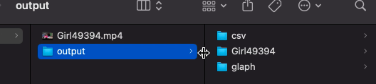

# GUIでOpenFaceを操作する

動画ファイルもしくは動画が含まれるフォルダをアプリケーション上にドラッグアンドドロップすることで，OpenFaceの`FaceLandmarkVidMulti`を実行します．


`FaceLandmarkVidMulti`の出力結果に加え，実行結果のCSVをまとめたフォルダ，AU06とAU12の散布図が出力されます．outputフォルダが作られ，その構成は以下のとおりです．

```bash
├── <動画ファイル名>.mp4
└── output
    ├── csv
    │   └── <動画ファイル名>.csv
    ├── glaph
    │   └── <動画ファイル名>.png
    └── <動画ファイル名>
        ├── <動画ファイル名>.avi
        ├── <動画ファイル名>.csv
        ├── <動画ファイル名>.hog
        ├── <動画ファイル名>_aligned
        └── <動画ファイル名>_of_details.txt
```

フォルダ(動画フォルダ)を入力した場合は次のようになります．

```bash
├── output
│   ├── csv
│   │   ├── vid1.csv
│   │   ├── vid2.csv
│   │   └── vid3.csv
│   ├── glaph
│   │   ├── vid1.png
│   │   ├── vid2.png
│   │   └── vid3.png
│   ├── vid1
│   │   ├── vid1.avi
│   │   ├── vid1.csv
│   │   ├── vid1.hog
│   │   ├── vid1_aligned
│   │   └── vid1_of_details.txt
│   ├── vid2
│   │   ├── vid2.avi
│   │   ├── vid2.csv
│   │   ├── vid2.hog
│   │   ├── vid2_aligned
│   │   └── vid2_of_details.txt
│   └── vid3
│       ├── vid3.avi
│       ├── vid3.csv
│       ├── vid3.hog
│       ├── vid3_aligned
│       └── vid3_of_details.txt
└── 動画フォルダ
    ├── vid1.mp4
    ├── vid2.mp4
    └── vid3.mp4

```


## 事前にインストールが必要なもの

- OpenFace 2.2.0
  - [Home · TadasBaltrusaitis/OpenFace Wiki](https://github.com/TadasBaltrusaitis/OpenFace/wiki)
- Python 3.8以上
- Kivy 2.0.0
  - [Installing Kivy — Kivy 2.0.0 documentation](https://kivy.org/doc/stable/gettingstarted/installation.html)


## 使い方

1. `main.py`の16,17行目付近にある以下のコードを修正します．

   OpenFaceがインストールされたディレクトリから，`FaceLandmarkVidMulti`を探し，そのフルパスを入力します．

  ```Python
  # Macの例
  # 【注意】環境に応じて適切なパスを選択する！！
  CMD = r"/Users/username/openface/OpenFace-OpenFace_2.2.0/build/bin/FaceLandmarkVidMulti"  # 実行するコマンドのパス
  ```
  ```Python
  # Windowsの例
  # 【注意】環境に応じて適切なパスを選択する！！
  CMD = r"C:\Users\username\OpenFace\OpenFace_2.2.0_win_x64\OpenFace_2.2.0_win_x64/FaceLandmarkVidMulti.exe"  # 実行するコマンドのパス
  ```

2. `main.py`を実行します．
3. 画面の指示に従って，動画ファイルもしくはフォルダをドラッグアンドドロップし，"RUN"ボタンを押します．
4. しばらく待ちます(数分かかります)
5. "実行完了"と表示されれば終了です．ウィンドウを閉じて終了してください．
6. 入力ファイルと同じフォルダに`output`ファイルが生成されています．


## 実行画面キャプチャ

起動画面


ファイルをドロップ


RUNボタンをクリック


実行開始


実行完了


出力フォルダの構成



フォルダでも実行可能


## 修正課題
- 出力するグラフの縦軸を固定長にする必要がある．OpenFaceはAU強度を0-5で出力するので，それに固定化する．
- やり取りするファイルサイズを削減する．CSV内でAUの情報のみを残す(視線，顔ランドマーク情報を消す)．tarなどで固める．
- 顔ランドマークのみの映像を出力する．プライバシーに関わる映像を含まないようにする．
